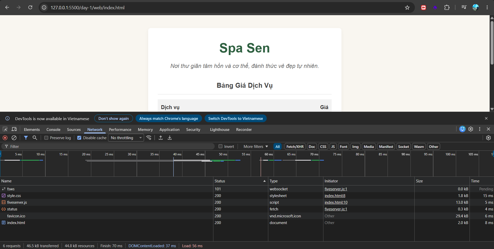

# Phân tích Network Requests (Day 1)

### 1. Request tải tài liệu HTML
* **URL:** `http://127.0.0.1:5500/day-1/web/index.html`
* **Method:** GET
* **Status code:** 200 
* **Loại body:** document (HTML)

### 2. Request tải stylesheet (CSS)
* **URL:** `http://127.0.0.1:5500/day-1/web/style.css`
* **Method:** GET
* **Status code:** 200 
* **Loại body:** stylesheet (CSS)

### 3. Request gọi API (JSON)
* **URL:** `https://jsonplaceholder.typicode.com/todos`
* **Method:** GET
* **Status code:** 200 OK
* **Loại body:** application/json
* **Cặp khoá - giá trị trong body:** Trong dữ liệu trả về có chứa cặp `"userId": 1` (khoá là chuỗi `"userId"`, giá trị là số `1`).
